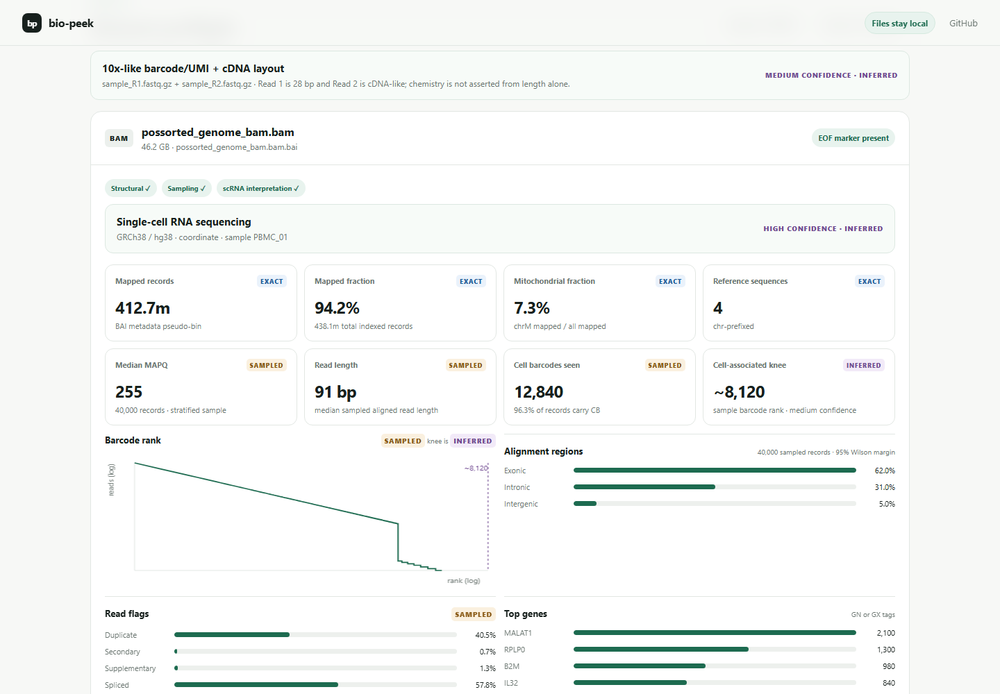

# bio-peek

[](https://github.com/matteobroketa/bio-peek/actions/workflows/ci.yml) [](https://matteobroketa.github.io/bio-peek/) [](LICENSE)

Inspect large sequencing files locally in your browser.

bio-peek reads BAM/BAI, FASTQ/FASTQ.GZ, and FASTA `.fai` files without uploading them. It reports exact header/index metrics and QC estimates from sampled records, with additional summaries for scRNA-seq BAMs.

[Open bio-peek](https://matteobroketa.github.io/bio-peek/)

No installation · no server · files remain on your device



## Supported files

### BAM + BAI

**Exact / metadata-derived**

- Reads the BAM header from BGZF blocks at the beginning of the file.
- Extracts references, lengths, sort order, read groups, samples, libraries and `@PG` provenance.
- Recognizes common GRCh38/GRCh37/GRCm38/GRCm39 reference layouts from canonical chromosome 1 lengths.
- Checks for the canonical BAM BGZF EOF marker.
- Parses BAI directly in JavaScript.
- Reads optional BAI metadata pseudo-bin `37450` for exact mapped and placed-unmapped read-segment counts per reference.
- Reads trailing `n_no_coor` when present for unplaced unmapped records.
- Produces idxstats-style per-reference counts without scanning the BAM.

**Sampled**

- Selects explicitly stratified seek points across references/index regions and decodes local BGZF windows from a coordinate-sorted BAM.
- Parses BAM core fields, CIGAR and selected auxiliary tags.
- Computes MAPQ, aligned read length, duplicate/secondary/supplementary/paired flags and spliced-alignment frequency.
- Detects scRNA-relevant tags including `CB`, `CR`, `UB`, `UR`, `GX`, `GN`, `RE`, `RG`, `MM/mm`, `NH` and `xf`.
- Builds sampled barcode-rank and top-gene distributions.
- Reports observed barcode and molecule complexity.

**Inferred**

- Identifies likely single-cell RNA sequencing when barcode + UMI + gene tags support that interpretation.
- Produces a preliminary barcode-knee estimate and bounded per-barcode reads/UMI/gene/mitochondrial sketches. These are explicitly labeled inferred and are not presented as exact cell calls.
- Reports a reference summary and heuristic QC checks for duplication, gene-tag coverage, mitochondrial signal, barcode-knee strength and unusual contigs.

### FASTQ / FASTQ.GZ

FASTQ files do not carry summary indexes. Uncompressed files use distributed byte ranges; ordinary gzip files are explicitly labeled as prefix/stream samples.

- Read-length distribution.
- Q20/Q30 base fraction.
- Per-cycle mean quality.
- Per-cycle A/C/G/T/N composition.
- GC distribution, N fraction and per-cycle sequence entropy.
- Observed duplicate fraction within the sample.
- Common Illumina adapter motif occurrence.
- Terminal poly-A and poly-G signal.
- Illumina header fields when recognizable.
- Conservative paired-layout inference (for example, a 28 bp R1 plus long R2 is reported as *10x-like barcode/UMI + cDNA*, not as a definitive chemistry call).
- When a resolved BAM and FASTQ pair are present, a bounded layout consistency check compares R1 barcode+UMI length, R2 length and Illumina lane metadata.

### FAI

- Parses standard five-column `.fai` indexes.
- Calculates sequence count, total reference length, N50 and L50 without opening the FASTA.

## How results are classified

Every user-facing metric is classified as one of:

- **EXACT** — obtained from complete metadata/index structures.
- **SAMPLED** — calculated from a bounded subset of actual records.
- **INFERRED** — an interpretation derived from observed structure and shown with confidence.

Sampled metrics report the number of records inspected and are never labeled exact.

## Methods

See [Methods](docs/METHODS.md) for the parsing, sampling and convergence model.

## Privacy and performance model

The app is entirely static. Files are passed to a Web Worker as browser `File` handles. Data is read with `Blob.slice()` and streams; it is not uploaded.

For BAMs, BGZF block sizes are parsed from the `BC` extra field and individual gzip members are decompressed locally. BAI virtual offsets provide actual compressed-block and in-block offsets. Before indexed metrics are shown, the BAI is checked against the BAM reference count and file bounds, representative BGZF members are decompressed, and representative BAM record boundaries/CIGAR/auxiliary fields are validated. The BAI is used only for seeking/count metadata—not as a proxy coverage histogram.

For uncompressed FASTQ, bounded byte ranges are sampled across the file. Ordinary gzip FASTQ is explicitly reported as a prefix stream sample because gzip has no random-access index. Four-line structure, printable quality bytes, base alphabet and read-number headers are validated and reported.

Deep BAM mode samples progressively in batches. It records checkpoint metrics and stops early only after the key medians and proportions converge; otherwise the result is labeled not converged at the sample limit. Sampled proportions include a 95% binomial uncertainty margin and report represented index regions/reference strata.

The BAM sampler maintains bounded per-barcode sketches for reads, UMIs, genes and mitochondrial observations. These are sampled barcode metrics, not Cell Ranger cell calls.

## Run locally

Because the application uses ES modules and a module Web Worker, serve the directory rather than opening `index.html` through `file://`.

```bash
python -m http.server 8000
```

Then open `http://localhost:8000`.

No build step or package install is required.

## GitHub Pages

The repository is directly deployable from its root with GitHub Pages. There are no runtime dependencies.

## Validation

```bash
npm test
npm run check
# Optional browser gate (requires Playwright browsers):
npm install
npx playwright install
npm run test:browser
```

Tests include synthetic spec-conformant BAI data and a synthetic BAM encoded as a real BGZF member. The BAM fixture verifies header decoding, EOF detection, BAI virtual-offset sampling, BAM record parsing and scRNA auxiliary tags.

The reproducible PBMC v3 golden recipe is available under `tests/golden/pbmc-v3`; it requires the official source files and local `samtools`/`seqkit` (with optional `fastp` and Cell Ranger output). After a browser export, `npm run golden:compare -- --bio-peek-json bio-peek.json` applies the declared tolerances. Results can also be handed off through the compact **Export receipt** text download.

## Important limitations

- BAI metadata counts are optional. When pseudo-bin `37450` is absent, mapped/unmapped counts are reported as unavailable.
- Distributed BAM sampling is not an exact whole-file statistic. Coordinate sorting, unusual index layouts or highly nonuniform record sizes can influence the sample.
- Selected BAM, BAI and FASTQ files are resolved into independent dataset groups. Files with unrelated or ambiguous names are surfaced as unassigned instead of being silently combined.
- The barcode-knee estimate is not a cell-calling method. Exact cell calling requires the appropriate single-cell pipeline and full molecule/count matrix context.
- The FASTQ parser targets conventional four-line sequencing FASTQ records, which covers standard Illumina/10x exports. Wrapped FASTQ is not supported.
- `quickcheck`-style EOF/header checks cannot detect corruption in the middle of a BAM.
- CRAM/CRAI is not implemented. CRAI should not be treated as a BAI-equivalent source of idxstats counts.
- Browser `DecompressionStream('gzip')` is required for BAM/BGZF and `.fastq.gz` inspection.
- Deep-mode convergence is a bounded stability diagnostic, not a proof that a sample is representative of every biological subpopulation.

## Development

The application is plain HTML, CSS and JavaScript with no build step. Run `npm test` and `npm run check` before opening a pull request; the browser gate runs Chromium, Firefox, WebKit and iOS WebKit coverage in CI.

## Source specifications

Implementation decisions follow the GA4GH/SAMtools SAM/BAM/BAI specification. In particular, BAI bin `37450` is the optional metadata pseudo-bin containing reference boundaries plus mapped and placed-unmapped counts; virtual offsets use the compressed BGZF block offset in the high bits and the uncompressed in-block offset in the low 16 bits.

10x scRNA interpretation follows the documented Cell Ranger BAM tags (`CB`, `UB`, `GX`, `GN`, `RE`, etc.).

## License

MIT
